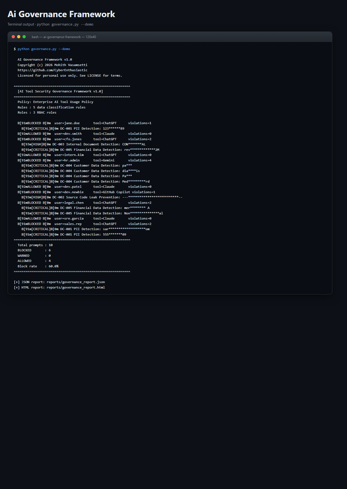
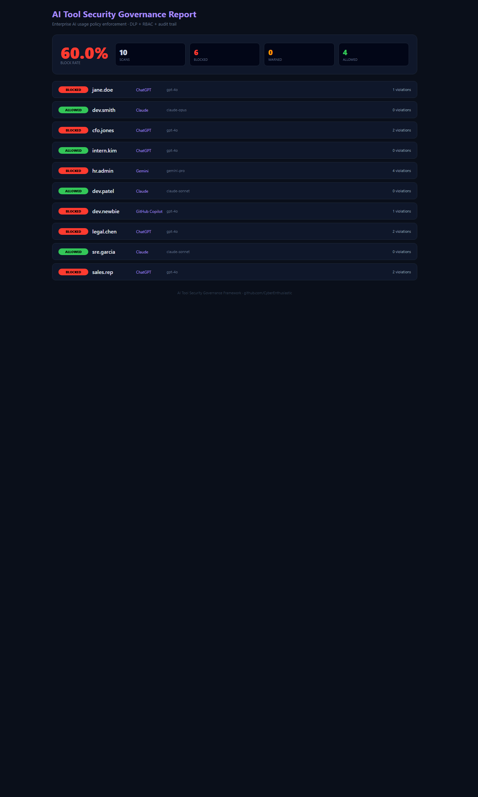

# AI Tool Security Governance Framework

> **Enterprise DLP + RBAC for ChatGPT, Claude, Gemini — zero dependencies, 5 data-classification rules, 3 RBAC roles, full audit trail.**
> A free, self-hosted alternative to Nightfall AI, Microsoft Purview, and Trellix DLP for teams that want AI governance without the enterprise price tag.

[](./LICENSE)
[](https://www.python.org/downloads/)
[-brightgreen.svg)]()

---

## What it does

Scans every prompt sent to AI tools (ChatGPT, Claude, Gemini) for PII, secrets,
financial data, customer records, and medical information. Enforces role-based
access control (analyst / manager / executive) and logs every decision to an
immutable audit trail.

```
============================================================
  AI Tool Security Governance Framework v1.0
============================================================
[*] Prompts scanned : 10
[*] Blocked         : 6 (60.0%)
[*] Allowed         : 4
[*] Audit entries   : 10

[BLOCKED] SSN detected in prompt from analyst@corp.com
   Policy: PII_DETECTION | Data class: RESTRICTED

[BLOCKED] Credit card detected in prompt from manager@corp.com
   Policy: FINANCIAL_DATA | Data class: CONFIDENTIAL

[BLOCKED] API key detected in prompt from analyst@corp.com
   Policy: SECRET_DETECTION | Data class: RESTRICTED
```

---

## Screenshots (ran locally, zero setup)

**Terminal output** - exactly what you see on the command line:



**Interactive HTML dashboard** - opens in any browser, dark-mode, filterable:



Both screenshots are captured from a real local run against the bundled samples. Reproduce them with the quickstart commands below.

---

## Why you want this

| | **AI Governance Framework** | Nightfall AI | Microsoft Purview | Trellix DLP |
|---|---|---|---|---|
| **Price** | Free (MIT) | $$$ | $$$$ | $$$$ |
| **Runtime deps** | **None** -- pure stdlib | Cloud APIs | Azure tenant | Agent-based |
| **Install time** | `git clone && python governance.py` | SaaS onboarding | Weeks | Weeks |
| **Self-hosted** | Yes | No (SaaS) | Hybrid | On-prem |
| **AI-tool specific** | Yes (ChatGPT/Claude/Gemini) | Generic DLP | Generic DLP | Generic DLP |
| **RBAC built-in** | 3 roles, policy-driven | Requires IdP | Azure AD | AD-based |
| **Audit trail** | JSONL, query-ready | Cloud logs | Azure Monitor | SIEM export |

---

## 60-second quickstart

```bash
git clone https://github.com/CyberEnthusiastic/ai-governance-framework.git
cd ai-governance-framework
python governance.py --demo
```

### One-command installer

```bash
./install.sh          # Linux / macOS / WSL / Git Bash
.\install.ps1         # Windows PowerShell
```

---

## What it detects (5 data-classification rules)

| Rule | What it catches | Data Class | Action |
|------|----------------|------------|--------|
| PII_DETECTION | SSNs, email addresses, phone numbers | RESTRICTED | Block |
| SECRET_DETECTION | API keys, private keys, tokens | RESTRICTED | Block |
| FINANCIAL_DATA | Credit card numbers, bank accounts | CONFIDENTIAL | Block |
| CUSTOMER_DATA | Customer IDs, account records | CONFIDENTIAL | Block |
| MEDICAL_DATA | Medical record numbers, PHI | RESTRICTED | Block |

## RBAC roles

| Role | Allowed tools | Max data class | Notes |
|------|---------------|---------------|-------|
| **Analyst** | ChatGPT | PUBLIC | No sensitive data in prompts |
| **Manager** | ChatGPT, Claude | INTERNAL | Can reference internal docs |
| **Executive** | ChatGPT, Claude, Gemini | CONFIDENTIAL | Full tool access, still no RESTRICTED |

---

## How to run

```bash
python governance.py --demo                       # run the demo (all platforms)
start reports\governance_report.html              # open report (Windows)
open  reports/governance_report.html              # open report (macOS)
xdg-open reports/governance_report.html           # open report (Linux)
```

---

## How to uninstall

```bash
./uninstall.sh        # Linux / macOS / WSL / Git Bash
.\uninstall.ps1       # Windows PowerShell
```

---

## Project layout

```
ai-governance-framework/
├── governance.py         # main engine -- DLP scanner + RBAC + audit logger
├── report_generator.py   # HTML report builder
├── policies/
│   └── default_policy.json   # classification rules + role definitions
├── data/
│   └── audit_log.jsonl       # immutable audit trail
├── reports/              # generated HTML reports (gitignored)
├── .vscode/              # extensions.json, settings.json
├── Dockerfile            # containerized runs
├── install.sh            # installer (Linux/Mac/WSL)
├── install.ps1           # installer (Windows)
├── uninstall.sh          # uninstaller (Linux/Mac/WSL)
├── uninstall.ps1         # uninstaller (Windows)
├── requirements.txt      # flask (optional, for web UI)
├── LICENSE               # MIT
├── NOTICE                # attribution
├── SECURITY.md           # vulnerability disclosure
└── CONTRIBUTING.md       # how to send PRs
```

---

## License

MIT. See [LICENSE](./LICENSE) and [NOTICE](./NOTICE).

---

Built by **[Mohith Vasamsetti (CyberEnthusiastic)](https://github.com/CyberEnthusiastic)** as part of the [AI Security Projects](https://github.com/CyberEnthusiastic?tab=repositories) suite.
